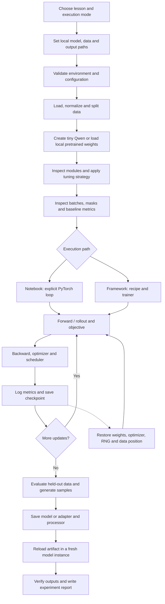
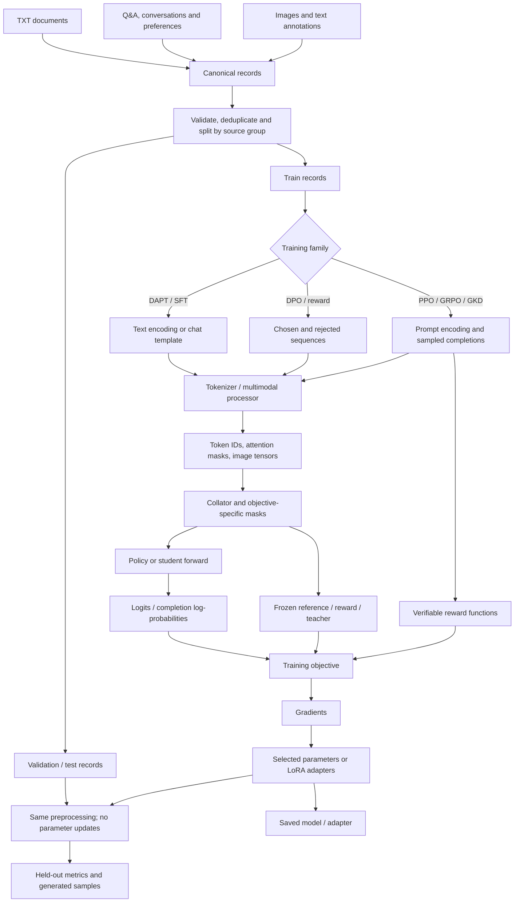
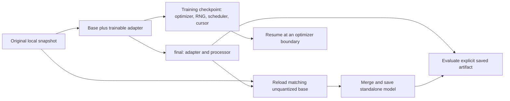

# Execution Flow and Data Flow

These diagrams describe the educational path and its connection to the implemented framework. Notebook training exposes tensor operations; CLI training enters through validated configuration and the recipe factory. Synthetic CPU models retain the official Qwen module implementations.

## Execution flow: control and lifecycle

The notebook SFT loop aggregates by valid target count, including the final partial accumulation window. Forward computes the objective; backward accumulates gradients; optimizer updates selected parameters; scheduler changes the learning rate. Saving inference weights and saving resumable training state are distinct operations.

The CLI route is `cli.py → workflows.py → load_datasets / build_trainer`. The factory calls the model adapter and parameter-selection code, then constructs the selected trainer. `runtime.py` handles run metadata. Notebook loss calculations stay in the cells.

## Data flow: records, tensors and learning signals

For rollout methods, prompts are first encoded and sampled completions become token sequences for a second, differentiable forward pass. Generation itself is under `no_grad()`. The diagram groups those two passes for readability.

Only follow the branches your method needs:

| Method | Learning signal | Frozen companion | Trained state |
|---|---|---|---|
| DAPT | Next domain token | None | Selected policy parameters |
| SFT | Assistant/completion token | None | Selected policy parameters |
| DPO | Preferred vs rejected answer log-probability | Reference policy | Policy |
| Reward modeling | Pairwise scalar score ordering | None | Reward model |
| PPO | Reward and advantage, plus value regression | Reference and reward model | Policy and value model |
| GRPO | Group-relative verifier rewards | Reference only if a KL term is enabled | Policy |
| GKD | Distribution divergence on student trajectories | Teacher | Student |

Text supervision uses `labels=-100` for ignored targets. Attention masks still expose the prompt. Image placeholders and padding are excluded from the loss; the visual encoder/merger supplies the embeddings. No image token truncation is performed.

## Artifact flow

`ftlab evaluate` defaults to the current run's `final/` and fails when it is absent. An explicit `--checkpoint` selects a baseline or another artifact. Evaluation reports and generated samples go into timestamped `evaluations/` subdirectories; the training configuration is preserved.

## Where to inspect each transition

| Transition | Notebook | Production boundary |
|---|---|---|
| Snapshot → modules | 00A | Model adapter |
| Files → records → masks | 00B, 01, 02, 07 | Data loader and Trainer collator |
| Requires-grad / LoRA | 00A, 02, 07 | Tuning strategy |
| Logits → objective | 01–07 | Recipe-specific Trainer |
| Updates → artifacts | 08 | Workflows and runtime |
| Artifact → evaluation | 08 | Evaluation workflow |
